# Configuring OSGeo LiveDVD v7.9 to access the Internet via the University of Nottingham network

## Setting Keyboard Layout

Open a Terminal window ("Applications/Accessories/Terminal Emulator"):

Type:

    sudo setxkbmap gb

Then hit return. You should see that the flag in the top-right of the VM window has become a Union Jack.

## Configure Firefox Proxy

Launch Firefox by selecting "Web browser" from the "Applications" menu:
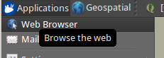

In the browser’s “Edit” menu select “Preferences”:
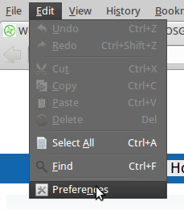

Then in the Preferences box select the “Advanced” button and the “Network” tab within it:
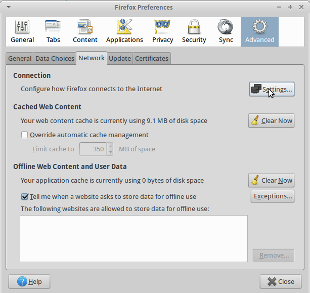

Click the “Settings” button to bring up the “Connection Settings” panel. Choose “Automatic proxy configuration URL” and enter

    http://wwwcache.nottingham.ac.uk/proxy.pac

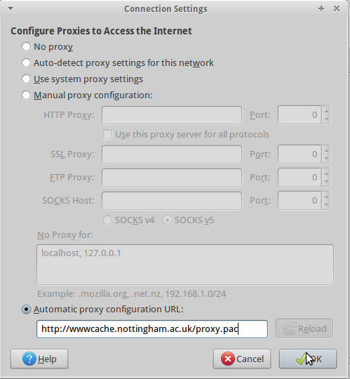

Click “OK” on the Connection Settings and then “Close” the Preferences panel. Try loading OSGeo's website (www.osgeo.org) to check that the browser now connects correctly.

## Configure Package Manager

From the “Applications” menu, (top-left of the screen), choose “Synaptic Package Manager”.

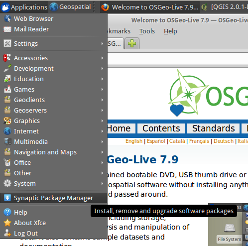

If prompted for a password, it is "user" (no quotes). You may also need to dismiss an initial introductory panel. Once the package manager starts, from its “Settings” menu select “Preferences”:

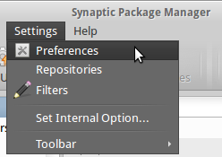

Click on the “Network” tab. Select a "Manual proxy configuration" and set an HTTP proxy of 128.243.253.109 on port 8080. 

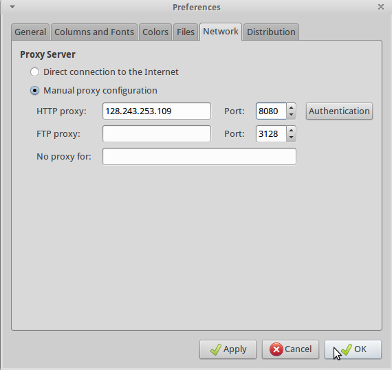

Finally click “OK” to dismiss the preferences panel. To refresh the package list (and check the network connection is working), select "Edit/Reload Package Information".

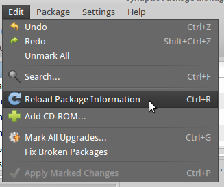

On a VM or USB system it's worth rebooting - not on a LiveDVD though, as the changes aren't persistent and won't be saved.

## Configure QGIS

We need to adjust the proxy details in QGIS too. Select "Applications/Education/QGIS" to start the program:

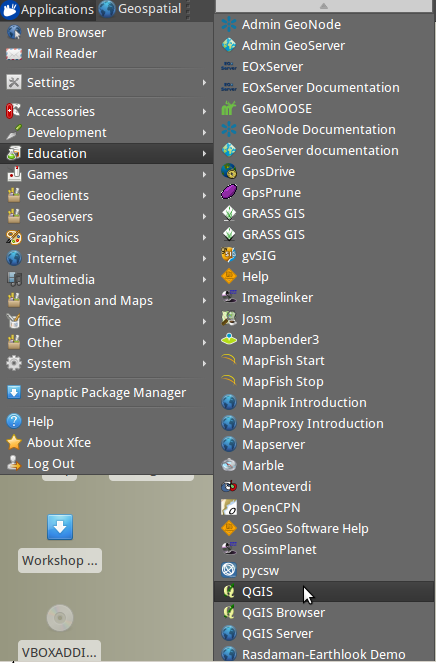

From the QGIS “Settings” menu select “Options…”:

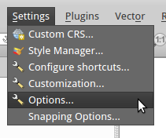 

When the Options dialogue  appears, select “Network” from the list on the left.First tick "Use proxy for web access". The "Host" is again 128.243.253.109 and the port is 8080, and the proxy type is an HttpProxy.

Under the "Exclude URLs" box click the "Add" button then double click on the "URL" text that appears in the box. Replace "URL" with "http://localhost" (no quotes) and press Enter:

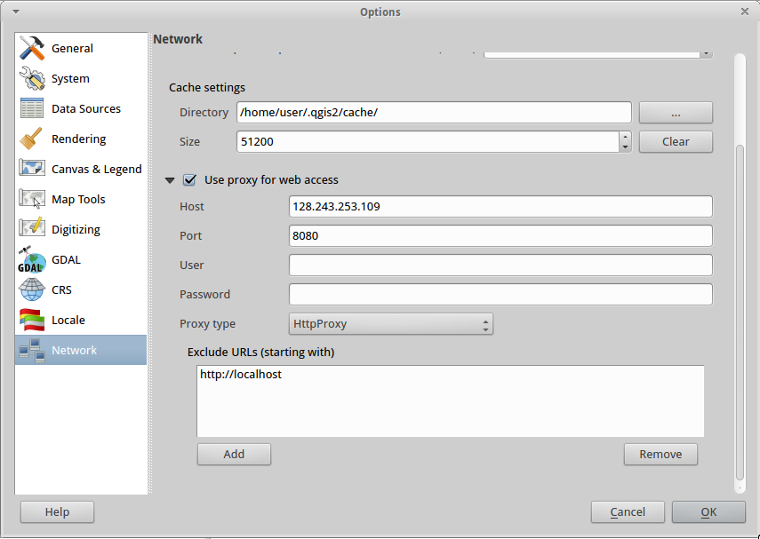

Finally click “OK” to dismiss the preferences panel. To check this has worked, go to the "Plugins" menu in QGIS and select "Manage and Install Plugins...". QGIS should connect ok to the default repository and get an updated list of available plugins:

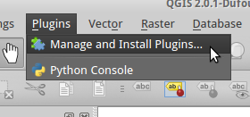

## Configure System Proxy

Open a Terminal window ("Applications/Accessories/Terminal Emulator"):

Type:

    sudo medit

Then press the Enter key. (If asked for a password, enter “user” and press Enter again.) An editor window will pop up. In the medit window, choose File/Open… Then find and open the file “environment” in the "/etc" directory. On a new line of its own at the bottom of the existing text add the line

    export http_proxy='http://128.243.253.109:8080'

and save the file.

Then load the file “.bashrc” also from the /etc directory and add the same line at the end of this file, and save the changes. Finally, quit from medit.

