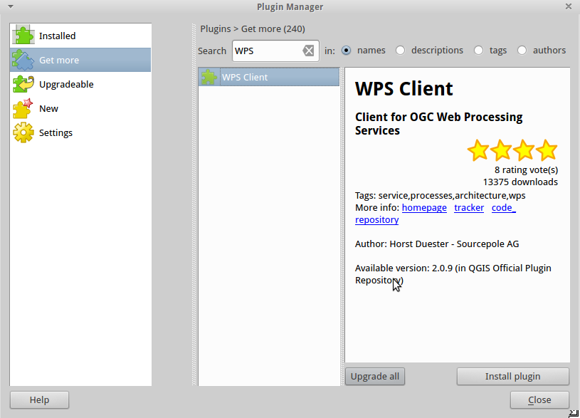
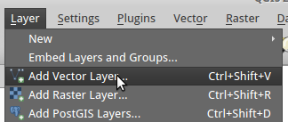
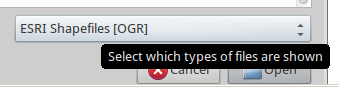
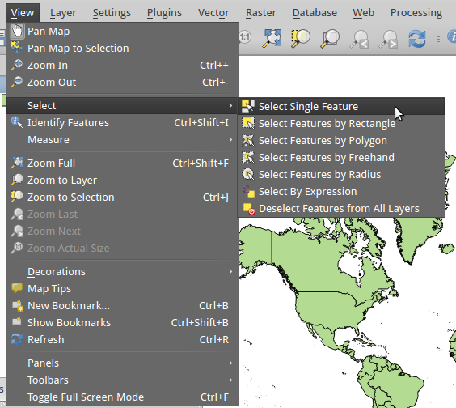
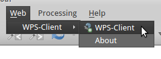
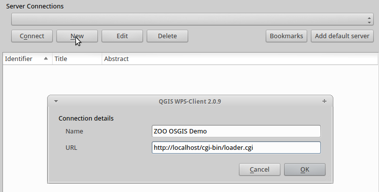
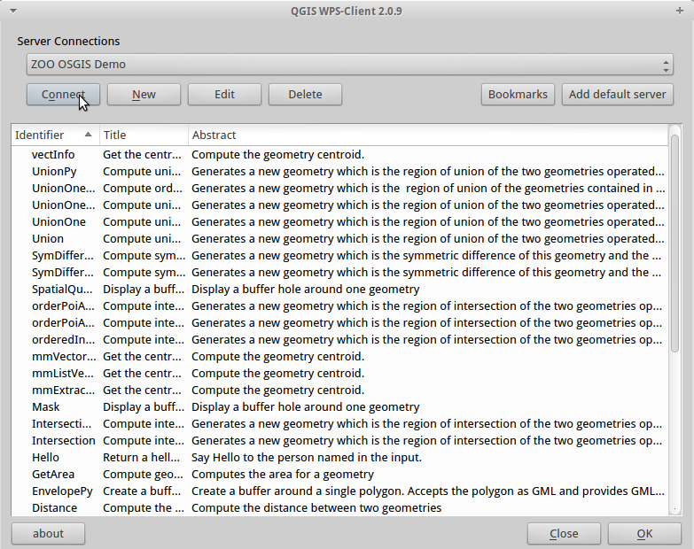
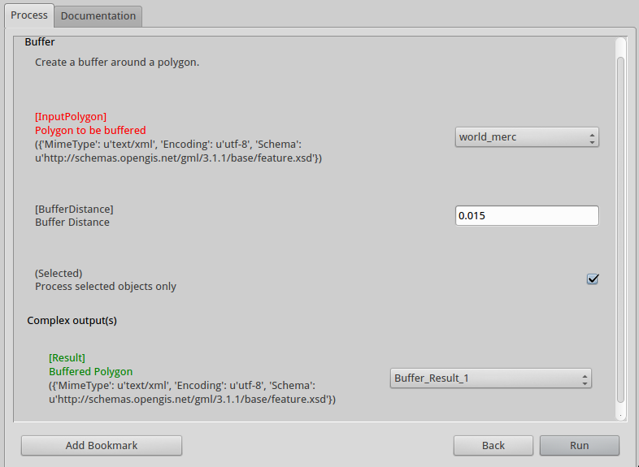
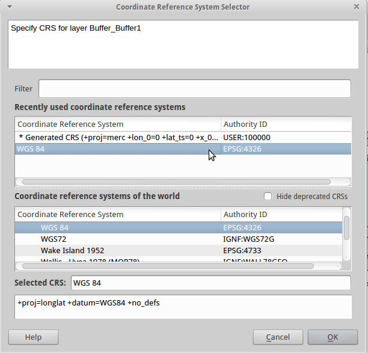

## Testing functions out

It's a bit more difficult to fully test our Buffer function in a browser, but we will use the DescribeProcess call to understand how it works. As before, type in a new browser tab:

    http://localhost/cgi-bin/zoo_loader.cgi?Service=WPS&Version=1.0.0&Request=DescribeProcess&Identifier=Buffer

We will use the QGIS WPS Plugin to Execute this process, to save trying to pass the nodes of a polygon via a URL!

Go to the Applications button in the top left of your screen and go to Education\QGIS (not QGIS browser or server):

This will load QGIS 2.0, which is a little out of date but the same process should hold for later versions. Chances are, the WPS plugin is not yet installed, so click on Plugins on the top menu, and then "Manage and Install Plugins":

Select "Get more from the list on the left, then in the Search bar, type WPS. In the results window you should see "WPS Client". Select it, then click on "Install plugin":
 

Hopefully you will receive a message that the plugin installed successfully, then click on "Close" in the bottom right to close the plugin manager.

First, load some suitable data to construct a buffer with. The OSGeo Live DVD contains plenty of spatial data for us to use. Click on "Layer/Add Vector Layer" in the QGIS menu:

For the source dataset, browse to /home/user/data/vector/world_merc and click on world_merc.shp. If you can't see this, make sure that the file type dropdown list at the bottom of the browser window shows "ESRI Shapefiles [OGR]":

Then click "Open", and "Open" in the "add vector layer" dialog box to load the shapefile in the main window.

If you try and run the buffer on the entire dataset, it could take some time, so first select a feature from the dataset. Got to "View/Select/Select Single Feature" from the menu and click on a feature in the map. Something small and simple will be quickest!

If you do not already see a WPS section in the bottom-left of QGIS, under the main Layers browser window, click on "Web" and then "WPS Client" in the top toolbar:

Click on "connect" in the WPS section, and then the "New" button to add a new WPS server. In the Name box, give your server a memorable name, such as ZOO OSGIS Demo:

In the URL box type the path to the zoo_loader.cgi:

    http://localhost/cgi-bin/zoo_loader.cgi

Click OK to make this dialogue box disappear, and then with your new connection visible in the Server Connections box, click "Connect" to connect to the server.

If the URL was correct, you should now see a long list of processes or Identifiers, with their Title and Abstract. If the list of Identifiers is not in alphabetical order, click the column title to sort it to your liking:

From the list, find the Buffer service, and either highlight it and click "OK", or double-click it. This will bring up a simple form with the Input Vales in it. Enter the following options:

* **Input Polygon**: this is a dropdown list of available layers- choose world_merc;
* **Buffer Distance**: the width of your buffer. The default value that you set in the config should already be loaded here but you will need to set it to around 10000 to see a visible result for the world_merc shapefile; 
* **Selected**: tick this box to buffer only the feature(s) that you have selected;
* **Result**: this shows the output- leave this as the default.

Once you have set the correct values for these, click "Run" to close this dialog box and run the process.

If you have remembered to tick the box to only use the selected features, this process should finish fairly quickly, and you should see a dialogue box asking you to choose the Coordinate Reference System for your new layer. Choose WGS84 (EPSG:4326), type 4326 in the filter box if this is not already shown as an option, and then choose it from either the "Recently used" box or "Coordinate Reference systems of the world" box, as appropriate:

Then click "OK" to see your new buffer layer on the map.

### Note for working with QGIS

The QGIS WPS plugin requires particular input and output formats to be configured for each process. For processes with a polygon input, such as Buffer, the default input format should be text/xml with the opengis gml feature schema, as below:

    <ComplexData>
        <Default>
            mimeType = text/xml
            encoding = UTF-8
            schema = http://schemas.opengis.net/gml/3.1.1/base/features.xsd
        </Default>
    </ComplexData>

There should also be a matching output format for this.

