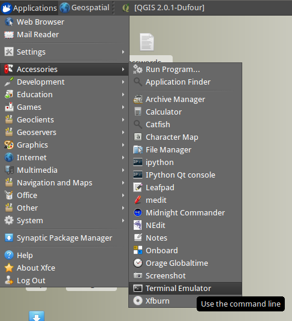

# Getting Started

We are going to be using ZOO for our WPS during this demo. A small amount of preparation work is required to get all the files we need.

## Setting Keyboard Layout

Open a Terminal window ("Applications/Accessories/Terminal Emulator"):

Type:

    sudo setxkbmap gb

Then hit return. You should see that the flag in the top-right of the VM window has become a Union Jack.

## Downloading our files

1. Right-click on a blank bit of desktop and choose 'open terminal' if you don't have one open already.
2. Copy the following commands one line at a time and paste them into your terminal using ctrl-v:
        wget http://www.archaeogeek.com/zoo.tar.bz2
        sudo tar -xvjpf zoo.tar.bz2 -C /
        sudo chmod -R 777 /usr/lib/cgi-bin/
        sudo chmod -R 777 /var/www/
        psql -f /var/www/temp/ws2013.sql
If asked for the sudo password, it's user
3. You also need to install an additional library (utility package) for ZOO to run. Again in your terminal type the following:
        sudo apt-get install libsvg-cairo
Type 'y' when prompted to install the required packages.
4. Restart the apache service to ensure it picks up the changes. Again in your terminal, type the following:
        sudo /etc/init.d/apache2 restart
... and guess what the sudo password is?

