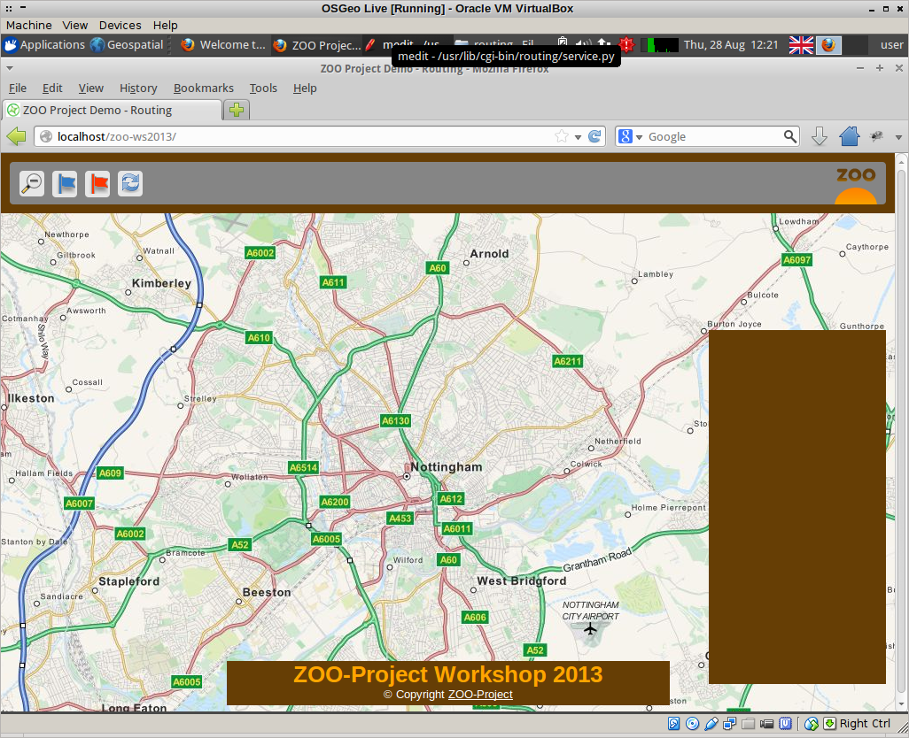
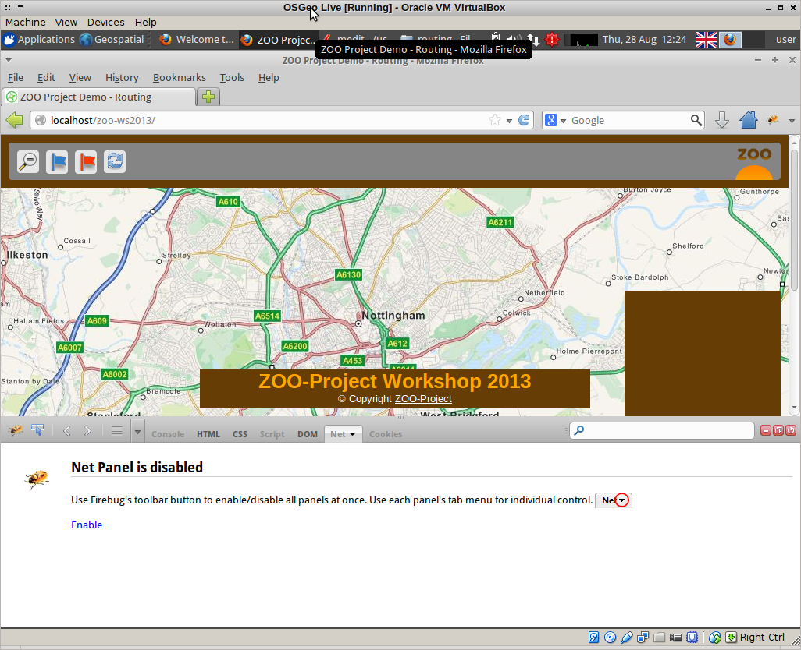
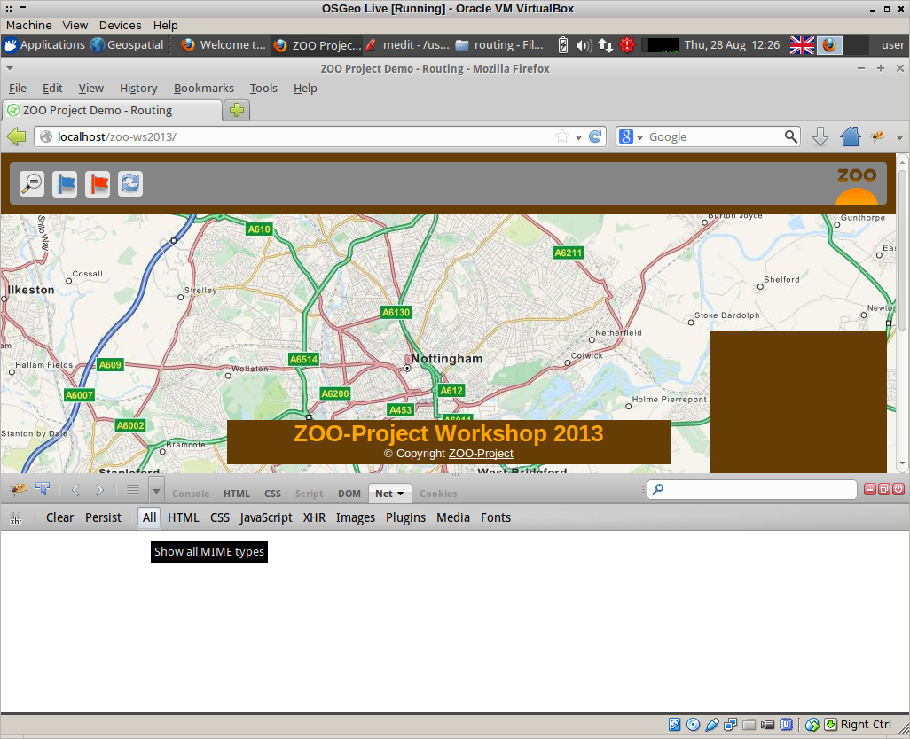
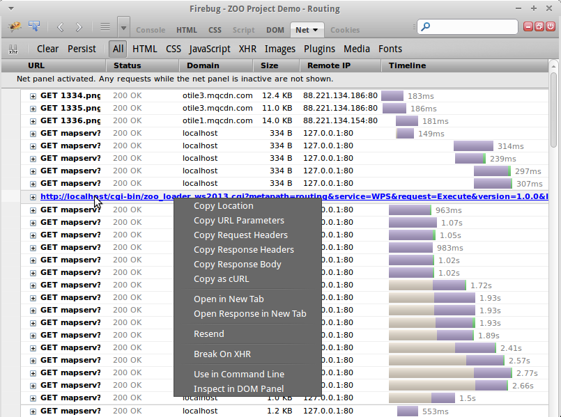
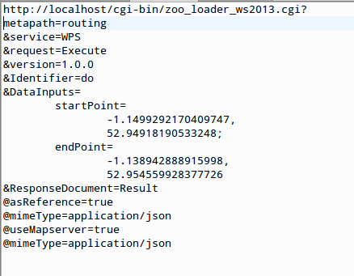
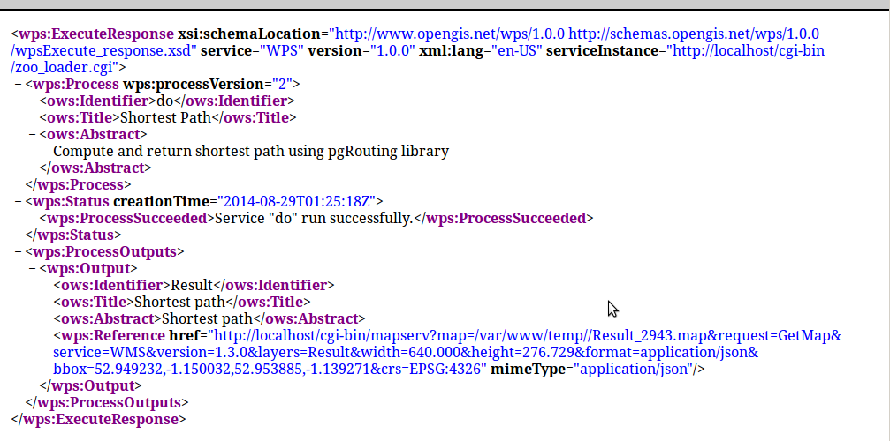
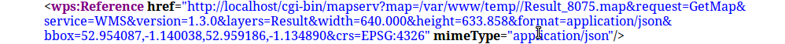
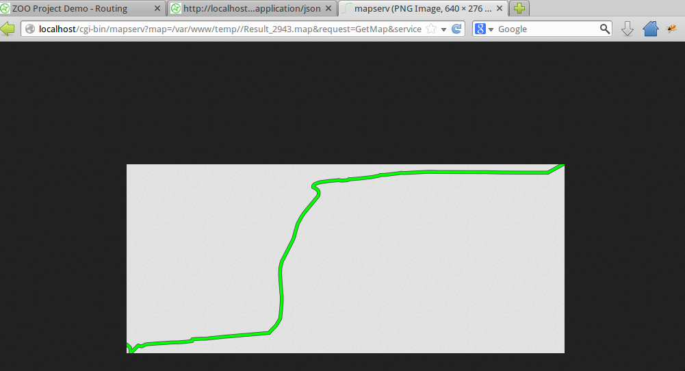
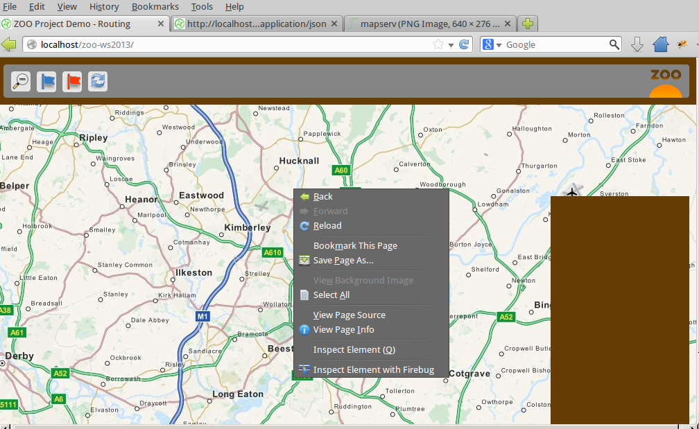

# Using the Routing Service in a web-based map

The WPS plugin doesn't seem to like the input and output format of the do service, so we'll go straight to seeing how this might work in a web-based map.

The ZOO Demo provides a really fully-featured example of this. Click on "Applications/Web Browser" to open firefox if it's not already open, and browse to:

    http://localhost/zoo-ws2013

Firstly we're going to enable firebug in firefox so that we can see what requests are being made back to our routing service. If the firebug icon in the top right of the firefox window is not active (ie it's grey) then click it to activate it. This should bring up a window at the bottom of the browser:

If "Net" is disabled, as it is in the screenshot above, click "enable" to make it active and ensure that the "All" tab is selected:

Then, reload the main page and watch the requests scroll by!

To start plotting a route, select the blue flag in the tool bar and click on the map where you'd like to start. Note that the routing data is not as extensive as the background map, so choose somewhere in the centre of Nottingham.

Select the red flag and click on the map to place it where you'd like to end your route. The further apart the two points are, the longer the route will take to compute.

This web application not only computes the shortest path route, but gives turn-by-turn directions, and computes the elevation.

In firebug, find the request that starts with "GET zoo_loader" and hover over it with your mouse to see the full request. Right-click the request and choose "Open in new tab". 

This is the "Execute" request to the WPS server, and when broken down it looks a lot like the ones we built earlier (with a few extra parameters):

Looking at the results of this in our browser tab we can see the ProcessOutputs:

Since we told WPS to use Mapserver, the response is a request to a temporary mapserver map file that we can potentially view in a browser. To do this, copy the reference href. It will look something like this:

Paste your response into a new browser tab. Unedited, it will not display as it is not in an image format, so change the format string in the URL from **application/json** to **image/png** to view the result:

## JavaScript

In order to send inputs to our routing process, we need to use JavaScript. 

The basic process for this is as follows:

1. Build the map (for example using OpenLayers) showing the base mapping that you want, and any overlays;
2. Add controls for establishing the start and end points of the route, for zooming in and out, resetting the page and so on;
3. Add a vector layer for holding the points that represent the start and end of the route;
4. Construct a URL that sends the Execute request off to the WPS service with the appropriate parameters;
5. Add a further layer to hold the json response from the WPS service.

While the demo page that we have been using is rather more complicated than that, if we view the source of it we can see these steps in action.

Right-click the web page and choose "View Page Source":

Amongst the scripts referenced at the top of the page are "spatialtools_files\demo.js" and "WPS.js".

 * **demo.js** is the file that actually builds the openlayers map, creates the controls, gathers the inputs for the various routing services available, and displays the output;
 * **wps.js** contains a number of helper functions for working with the WPS server.

If we click on the link to "spatialtools_files\demo.js" (line 18) then we can explore the process of gathering the inputs for the do service.

The first half of this file, down to approximately line 596, is dedicated to building the map and the controls, and adding handlers for selecting and dragging the flags to indicate the start and end points of the route.

Line 190 onwards shows the creation of a points layer to hold the values of our start and end point, and it ensures that the first point added to the map is given the attribute "start" and the second "end". These are sent to a function called pgRouting at around line 314.

Some additional code here also handles the case where the markers are dragged to a different location- but again at line 367 the points layer is sent to the pgRouting function.

This function is actually defined at line 722, where it checks that there are at least 2 points provided, and then sends them off to another function called runRouting. 

The runRouting function is defined at line 597, and the first thing it does is transform the points from EPSG 900913 to EPS 4326. At line 628 it contructs the URL for the Execute request. Line 650 onwards are concerned with creating a layer to display the results.

Finally, two further WPS processes are also called in this block: UnionOneGeom and computeRouteProfile. These are needed for the elevation profile which is also computed, and the turn-by-turn directions.

If you are interested in building your own web application for WPS using openlayers then there are a number of useful tutorials. For one that is specific to ZOO, I would recommend the [Practical Introduction to ZOO](http://www.zoo-project.org/docs/workshop/2010/index.html) given at FOSS4G 2010 (Osaka).

